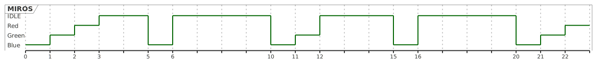

# Earliest Deadline First Algorithm

# Acknowledgment
This project was super hard on me without the guidance of **ALLAH** This project would never come to life.


# Introduction 
This is an Implementation of Earliest Deadline First Algorithm Using [Sorted Queue](../SortedQueue/README.md) and a [Dynamic Memory Allocator with pre-defined memory](../DynamicMemory/README.md) on Minimal Realtime Operating System **(MIROS)** following up doctor Miro Semch on his [course Video](https://www.youtube.com/watch?v=gQOv8o5lS2k&list=PLPW8O6W-1chwyTzI3BHwBLbGQoPFxPAPM&index=45), and his codes are [here](https://www.state-machine.com/video-course).

## Project Description
we have three threads: 

```c
void os_idleThreadHandler() {
  while (1) {
  }
}


void blinkGreen() {
  while (1){
    UARTprintf("Green\n");
    bsp_LedGreenOn();
    bsp_LedsOffAll();

    // giving the control to the OS
    os_threadYield();
  }
}


void blinkBlue() {
  while(1){
    UARTprintf("Blue\n");
    bsp_LedBlueOn();
    bsp_LedsOffAll();

    // giving the control to the OS
    os_threadYield();
  }
}


void blinkRed() {
  while(1){
    UARTprintf("Red\n");
    bsp_LedRedOn();
    bsp_LedsOffAll();

    // giving the control to the OS
    os_threadYield();
  }
}
```


These threads are periodic with the following rates: 
| Thread's Name | Rate |
|---------------|------|
| blinkRed      | 200  |
| blinkGreen    | 100  |
| blinkBlue     | 50   |

The output is the following on the serial with Baud rate of `115200`
```bash
starting ->>
Blue
Green
Red
Blue
Blue
Green
Blue
Blue
Green
Red
Blue
Blue
Green
Blue
Blue
Green
Red
Blue
Blue
Green
Blue
Blue
Green
Red
```
As shown in the Figure


# Project Structure

```
├── CMakeLists.txt                    #the cmake file to build the project 
├── DynamicMemory                     # the dynamic memeory module 
│   ├── DynamicMemory.c
│   ├── DynamicMemory.h
│   └── README.md
├── inc
│   ├── BoardSupportPackage.h         # the hardware of the our MIROS
│   ├── DynamicMemoryTypes.h          # The types of the SortedQueue structure
│   ├── miros.h                       # he header file of the Minimal Realtime Operating System
│   └── tm4c123gh6pm.h                # the definition of tm4c123g6pm microcontroller
├── README.md                         # the documentation of the project
├── SortedQueue                       # the SortedQueue data structure
│   ├── README.md
│   ├── SortedQueue.c
│   └── SortedQueue.h
├── src
│   ├── BoardSupportPackage.c         # Source file of the OS's hardware
│   ├── main.c
│   ├── miros.c                       # the source file of the Miniaml Realtime Operating System
│   └── startup.c                     # the startup file
├── tiva.specs
├── tm4c123g.cmake                    # extention of the cmake file
└── tm4c123g.ld                       # load file that contains allocationf of the flash, SRAM, stack, heap
|tivaware                             # The drivers of the tm4c123gh6pm from TI


```

# Earliest Deadline First Algorithm overview
## Threads descriptions
Every thread is a periodic thread that has
* a rate at which it arrives.
* a descending counter `deadlineCounter` to the deadline (new arrival)

At OS's tick:
```
1. Decremnt every thead's counter -->> deadlineConter --
2. push new thread to serviceQueue which will sort the threads with respect to their deadlineCounter 
3- if the currentThread called os_thread yield remove it form serviceQueue
4. switch context to the first theread in the queue if serviceQueue is not empty
5- if servieQueue is empty switch context to the idleThread

```


# Step by Step Details
## Structures that control the code flow:
```c
/*
 * the definition of the Thread struct
 */
typedef struct {
  os_StackElement *sp;
  os_StackElement stack[THREAD_STACK_SIZE];
  uint32_t rate;
  int32_t deadlineCounter;
} os_Thread;

```


```c
//------------------------------------------------
// Idle thread
//------------------------------------------------
os_Thread os_idleThread;
extern void os_idleThreadHandler();

//------------------------------------------------
// for Scheduler
//------------------------------------------------
// the array that will hold all threads created by the user
os_Thread *volatile os_threadPool[MAX_NUM_THREADS];

// the sorted queue to handle EarliestDeadlineFirst algorithm
// that sorts threads with rescpect to their deadlineCounter
// ascendingly
sq_Queue os_serviceQueue; 

// holds a pointer to the current thread holds CPU struct
os_Thread *volatile os_currentThread;

// holds a pointer to the next thread struct.
os_Thread *volatile os_nextThread;

// 1 if the current thread called `os_threadYield()`, 0 otherwise
uint8_t os_yield;
```

## Detailed Algorithm without `os_threadYield`

at every Systick we call `BoardSupportPackage.c:SystickHandler` 
```c
void SystickHandler(void) {
  // disabling interrupt 
  IntMasterDisable();

  // decrement thread->deadlineCouner for all threads and.
  // puhes new threads to the os_servieQueue
  os_tick();

  // reomoves the current thread that called os_threadYield. 
  //and gets the next thread to run form the foint of the Ascednding order
  os_sched();

  // enabling interrupt 
  IntMasterEnable();
}
```

```c
void os_tick() {
  os_Thread *thread;
  uint32_t i=0;
  for(i=0; i<os_threadCounter;i++) {
    thread = os_threadPool[i];

    // thread has come
    if (thread->deadlineCounter ==0)
      {
        // initializing daedline and decrement it
        thread->deadlineCounter = thread->rate -1;

        //pushing the thread in the service queue
        // we push the deadline by reference not
        // by value
        // because deadline will decrement over
        // time so the queue is up to date with
        // the new dealine update
        sq_pushAndSort(&os_serviceQueue,
                       thread,
                       &(thread->deadlineCounter));
      } else {
      //decrement the counter of the thread
      thread->deadlineCounter --;
    }
  }

}


```


```c
void os_sched(){

  // if os_yield=1
  if (os_yield==1) {

    // take the task out of the queue
    sq_popFront(&os_serviceQueue);

    // os_yield=0
    os_yield =0;
  }

  // if the os_serviceQueue is empty
  // run os_idleThread
  if (sq_isEmpty(&os_serviceQueue)) {
    os_nextThread = &os_idleThread;
  } else {
    //set the next thread
    os_nextThread =sq_showFront(&os_serviceQueue);
  }


  if (os_currentThread != os_nextThread) {
    os_switchContext =1;
    //fires pendsv interrupt INTCTRL bit 28
    NVIC_INT_CTRL_R |= 0x10000000;
  }
}


```


```c
void PendsvHandler(void) {
  __asm volatile
    (
     "CPSID   I      \n " //disable interrupt

     /* if (OS_curr != (os_currentThread *)0) */
     "  LDR           r1,=os_currentThread  \n"
     "  LDR           r1,[r1,#0x00]     \n"
     "  CBZ           r1,next_thread \n"

     /*     push registers r4-r11 on the stack */
     "  PUSH          {r4-r11}          \n"

     // currentThread->sp = sp
     "  LDR           r1,=os_currentThread  \n"
     "  LDR           r1,[r1,#0x00]     \n"
     "  STR           sp,[r1,#0x00]     \n"

     "next_thread:                      \n"
     // sp = nextThread->sp
     "  LDR           r1,=os_nextThread  \n"
     "  LDR           r1,[r1,#0x00]     \n"
     "  LDR           sp,[r1,#0x00]     \n"


     /* os_currentThread = os_nextThread ; */
     "  LDR           r1,=os_nextThread \n"
     "  LDR           r1,[r1,#0x00]     \n"
     "  LDR           r2,=os_currentThread  \n"
     "  STR           r1,[r2,#0x00]     \n"

     /* pop registers r4-r11 */
     "  POP           {r4-r11}          \n"

     "CPSIE   I      \n " //disable interrupt


     /* return to the next thread */
     "  BX            lr                \n"
     );


```
## Detailed Algorithm when `os_ThreadYield()` is called
```c
void os_threadYield(os_Thread *thread) {
  IntMasterDisable();

  // seting this flag to get the currnt thread out of the os_serviceQueue
  os_yield=1;
  os_sched();

  IntMasterEnable();
}

```

# Tools

This project is based on `arm-none-eabi` tool chain and `TI Tivaware APIs`, and `CMake` and was built on Linux machine. We used `[openocd](https://openocd.org/)` and `arm-none-eabi-gdb` for debugging. The detailed describtion how to use the debugger is [here](../README.md)

# Building this project
make sure your have `cmake`, `arm-none-eabi tool chain`, `openocd` on your machine 
```bash
git clone https://github.com/Abdullahaml1/real-time-kernel
cd 16-MIROS_EarliestDeadlineFirst
mkidr build
cd build
cmake ..
make
```

then flash the binary file on the tm4c123g6pm board. I used openocd to flash the board: 
```bash
sudo openocd /user/loacl/share/scripts/board/ti_ek-tm4c123gxl.cfg
```

you will see output like this:
```bash
Open On-Chip Debugger 0.11.0+dev-00631-g6c9dd1c6b (2022-04-01-22:23)
Licensed under GNU GPL v2
For bug reports, read
	http://openocd.org/doc/doxygen/bugs.html
Info : The selected transport took over low-level target control. The results might differ compared to plain JTAG/SWD
Info : Listening on port 6666 for tcl connections
Info : Listening on port 4444 for telnet connections
Info : clock speed 22100 kHz
Info : ICDI Firmware version: 9270
Error: SRST error
Info : [tm4c123gh6pm.cpu] Cortex-M4 r0p1 processor detected
Info : [tm4c123gh6pm.cpu] target has 6 breakpoints, 4 watchpoints
Info : starting gdb server for tm4c123gh6pm.cpu on 3333
Info : Listening on port 3333 for gdb connections
```
Open another terminal to run `arm-none-eabi-gdb` to debug and flash the code in `real-time-kernel/16-MIROS_EarliestDeadlineFirst/build`

```bash
arm-none-eabi-gdb MIROS_ErliestDeadLineFirst.elf
```

then connect `openocd` to `gdb`
```bash
tar ext :3333
```

reset the MCU
```bash
monitor reset halt
```

load the code
```bash
load
```

